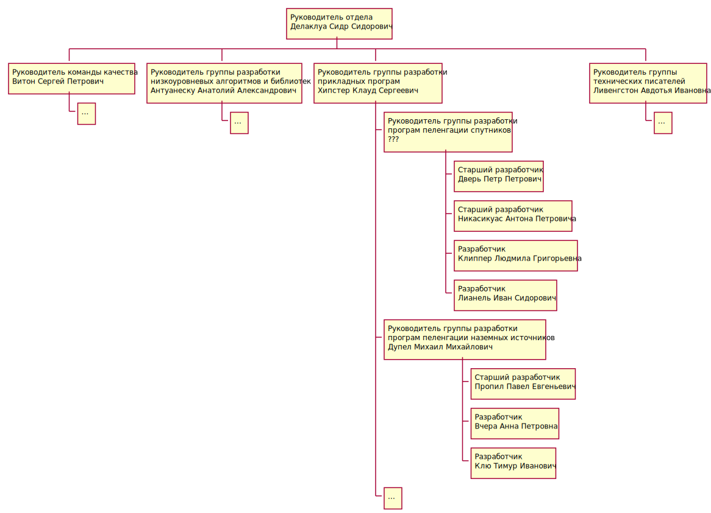

# Построение структуры линейных подразделений. Выбор и инициация линейных руководителей

**Цель**: представить структуру своего отдела, предполагающую наличие
"подчиненных руководителей" (по возможности обозначить кандидатов и обосновать
выбор) составить план вводной беседы с новоиспеченным управленцем.
Вместо реальных имен можно использовать вымышленные, инициалы или просто роли с
грейдами. Если у вас нет подчиненных - сделайте задание как буд-то бы вы
руководите подразделением в котором сейчас работаете

## 1. Представить структуру своего отдела, предполагающую наличие "подчиненных руководителей"

Нужно выбрать Руководителя группы разработки програм пеленгации спутников.

## 2. По возможности обозначить кандидатов и обосновать выбор

Предлагаю на эту должность Никасикуас Антона Петровича. Т.к. Антон Петрович:

* Хорошо разбирается в предметной области. Занимается разработкой програм
пеленгации спутников последнии 3 года.
* Самостоятельный, инициативный, надежный. Много раз проявлял уместную
инициативу и доводил дело до успешного конца.
* Обладает довольно высоким неформальным авторитетом в команде разработки
програм пеленгации спутников. Сотрудники прислушиваются к его мнению, доверяют ему.
* Разделяет мои ценности и взгляды (а я - руководитель группы разработки прикладных
програм - Хипстер Клауд Сергеевич). Не раз бывало такое, что я просил его
"Сделать чтобы все было нормально" и он делал именно то, что нужно, даже чуть лучше.

## Составить план вводной беседы с новоиспеченным управленцем

1. Поздороваться, спросить как дела. SmallTalk.
2. Сказать, что мне нужен в деле руководства командой разрабоки програм
пеленгации спутников. И я думаю, что отлично справится с этой работой.
3. Рассказать как изменятся его обязанности:
   1. Меньше разработки
   2. Больше руководства людьми
   3. Больше внимания на процессы внутри команды
   4. Проводить мои решения внутрь команды
   5. Больше ответственности
4. Рассказать про изменения в зарплате и условиях труда. (возможно отдельный кабинет)
5. Спросить, хочет ли он занять эту должность.
6. Ответить на вопросы.
