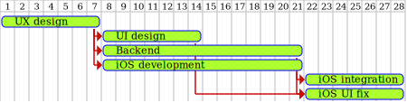
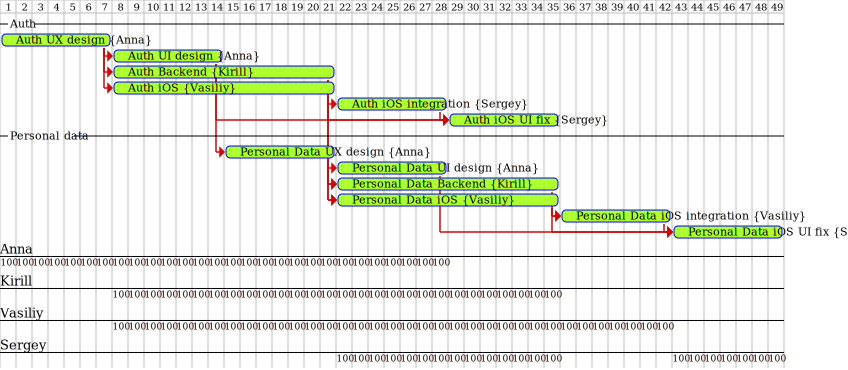

# Декомпозиция проблемы

**Цель**: В прошлом ДЗ мы работали с уже решённой проблемой. Теперь попробуем
разобраться с текущей проблемой.

## 1. Опишите текущий большой проект. Каковы сроки выполнения проекта

В данный момент подходящего проекта под описание нет. По этому опишу один из
прошлых проектов.

Проект "MVP мобильного приложение - личный кабинет клиента страховой компании".
Я его описывал в задании 03-nda, т.о. требования к MVP описывать здесь не буду.

Сроки выполнения 6 месяцев.

## 2. Какой уровень декомпозиции будет необходим и достаточен для него? Почему

Я думаю будет достаточно среднего уровня декомпозиции (3-4 уровня).
Этого будет достаточно для координации разных подразделений (мобильные
разработчики, бэкэнд, дизайнеры и т.д.) и для первичной оценки сроков.

## 3. Разбейте задачу на части и обозначьте зависимости частей

Каждый модуль (Auth, Personal Data и т.д.) внутри себя разбивается на зависимые
части примерно следующим образом (Android, тестирование, ci/cd и т.д. опустил
для простоты)

## 4. * Составьте диаграмму Ганта по частям задачи с учётом ресурсов. Попадаете ли Вы в срок, обозначенный в 1 пункте

Полную диаграмму приводить не стал (очень долго + она бы никуда не влезла).
Привожу диаграмму для первый 2-х модулей максимально упрощенную.

По первичному плану на каждый модуль уходит примерно одинаковое количество времени,
т.о. если нарисовать все 6 модулей, то в целом работа займет 5 месяцев из 6. Это
нормально, т.к. последний месяц на различного рода риски и шлифовку.
